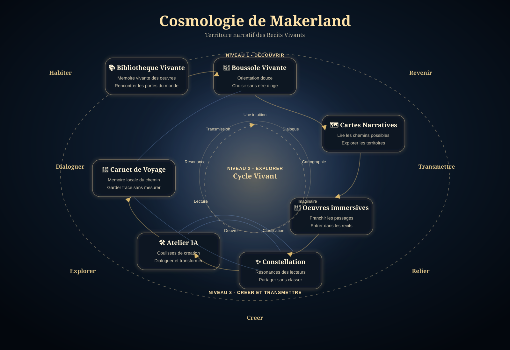

# Cosmologie de Makerland

La Cosmologie de Makerland est la representation officielle du territoire des Recits Vivants.

Elle ne decrit pas une architecture technique.

Elle montre comment les lieux, les passages, les cycles et les intentions forment une meme ecologie narrative.

Carte de reference:



## 1. Role de la carte

La carte permet de comprendre Makerland en un seul regard.

Elle montre:

- les sept grands lieux;
- les relations principales;
- les cycles de creation et de resonance;
- les niveaux du territoire;
- les verbes fondateurs qui organisent l'experience.

Elle complete les documents fondateurs:

- `README.md` pour entrer dans le projet;
- `MAKERLAND_MASTERPLAN_v1.0.md` pour comprendre la vision;
- `DEVELOPMENT_PRINCIPLES.md` pour guider les evolutions;
- `MANIFESTO.md` pour exprimer l'intention;
- `MAKERLAND_COSMOLOGY.md` pour voir comment tout est relie.

## 2. Les sept lieux

### Bibliotheque Vivante

La Bibliotheque Vivante est la memoire vivante des oeuvres.

Elle ne stocke pas des livres.

Elle organise des presences et des portes.

Fonction: rencontrer les oeuvres comme des lieux a traverser.

### Boussole Vivante

La Boussole Vivante est le lieu d'orientation douce.

Elle ne choisit pas pour le visiteur.

Elle propose plusieurs directions et laisse la liberte intacte.

Fonction: aider a reprendre une orientation sans imposer un chemin.

### Cartes Narratives

Les Cartes Narratives rendent visibles les relations, les passages et les territoires.

Elles n'enferment pas le monde.

Elles ouvrent des manieres de le regarder.

Fonction: explorer les structures et les chemins des Recits Vivants.

### Oeuvres immersives

Les oeuvres immersives sont les territoires dans lesquels le visiteur entre pleinement.

Elles prolongent les livres, les cartes et les passages.

Fonction: faire vivre les recits comme des mondes.

### Atelier IA

L'Atelier IA montre les coulisses de creation.

Il ne presente pas une demonstration technique.

Il rend perceptible la naissance des oeuvres: dialogues, cartes, images, clarifications et versions.

Fonction: comprendre comment une intuition devient une oeuvre.

### Constellation

La Constellation accueille les resonances des lecteurs.

Elle ne collecte pas des profils.

Elle montre la seconde vie des recits.

Fonction: relier les traces, temoignages et fragments sans les classer.

### Carnet de Voyage

Le Carnet de Voyage garde la memoire locale du parcours.

Il ne mesure rien.

Il ne recompense rien.

Fonction: conserver une trace poetique du voyage sans gamification.

## 3. Les relations principales

La relation principale suit le chemin:

```text
Bibliotheque
  -> Boussole
  -> Cartes
  -> Oeuvres
  -> Constellation
  -> Carnet
```

Ce chemin n'est pas obligatoire.

Il represente simplement une traversee possible.

Une seconde relation relie la creation et la resonance:

```text
Atelier
  -> Oeuvres
  -> Constellation
  -> Atelier
```

L'Atelier nourrit les oeuvres.

Les oeuvres nourrissent la Constellation.

La Constellation nourrit de nouveaux recits.

Le Carnet accompagne tout le voyage.

## 4. Le Cycle Vivant

Le cycle vivant est circulaire.

Il n'a aucun debut absolu et aucune fin definitive.

```text
Une intuition
  -> Dialogue
  -> Cartographie
  -> Imaginaire
  -> Clarification
  -> Oeuvre
  -> Lecture
  -> Resonance
  -> Transmission
  -> Nouvelle intuition
```

Ce cycle explique pourquoi Makerland n'est pas seulement une bibliotheque.

C'est un monde ou les oeuvres naissent, circulent, rencontrent des lecteurs et reviennent nourrir de nouvelles formes.

## 5. Les niveaux du territoire

La cosmologie distingue trois dimensions.

### Niveau 1 - Decouvrir

Lieux:

- Bibliotheque Vivante;
- Boussole Vivante.

Intention: entrer dans le territoire et trouver une orientation.

### Niveau 2 - Explorer

Lieux:

- Cartes Narratives;
- Oeuvres immersives.

Intention: traverser les recits, les cartes et les passages.

### Niveau 3 - Creer et transmettre

Lieux:

- Atelier IA;
- Constellation;
- Carnet de Voyage.

Intention: comprendre la creation, accueillir les resonances et garder trace du voyage.

## 6. Les verbes fondateurs

Autour de la carte apparaissent les grands verbes de Makerland:

- Habiter;
- Dialoguer;
- Explorer;
- Creer;
- Relier;
- Transmettre;
- Revenir.

Ces verbes ne sont pas des fonctions.

Ils indiquent des attitudes.

Chaque future evolution devra pouvoir se rattacher a au moins l'un de ces verbes sans rompre les autres.

## 7. Lecture narrative de la cosmologie

Makerland peut etre lu comme une respiration:

1. Le visiteur arrive dans la Bibliotheque.
2. Il retrouve une orientation dans la Boussole.
3. Il explore les Cartes et les Oeuvres.
4. Il decouvre les coulisses dans l'Atelier.
5. Il percoit les resonances dans la Constellation.
6. Il retrouve ses traces dans le Carnet.
7. Il peut revenir autrement.

Cette lecture n'est pas une obligation.

Elle donne une coherence a la liberte du visiteur.

## 8. Preparation des futurs developpements

Le SVG a ete concu pour rester extensible.

Il pourra accueillir plus tard:

- de nouveaux lieux;
- de nouvelles oeuvres;
- de nouvelles cartes;
- de nouveaux objets NFC;
- de nouvelles passerelles;
- de nouveaux cycles secondaires;
- de nouvelles relations entre lecteurs, oeuvres et fragments.

La regle restera la meme:

un ajout ne doit pas encombrer la carte.

Il doit rendre le territoire plus lisible.

## 9. Principe de coherence

La Cosmologie de Makerland rappelle que le projet n'est pas un ensemble de pages reliees entre elles.

C'est un territoire vivant.

Les oeuvres, les dialogues, les cartes, les lecteurs, les objets, les lieux et les recits y participent a une meme ecologie narrative.

Une evolution est juste lorsqu'elle renforce cette ecologie sans transformer Makerland en application utilitaire.
